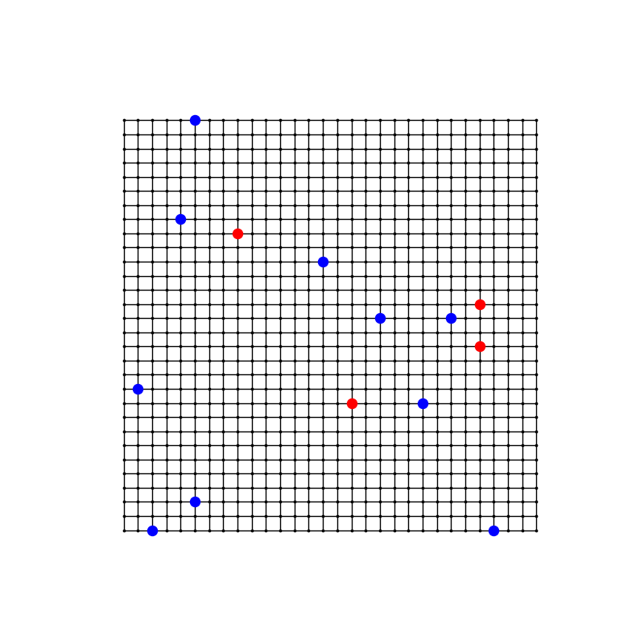
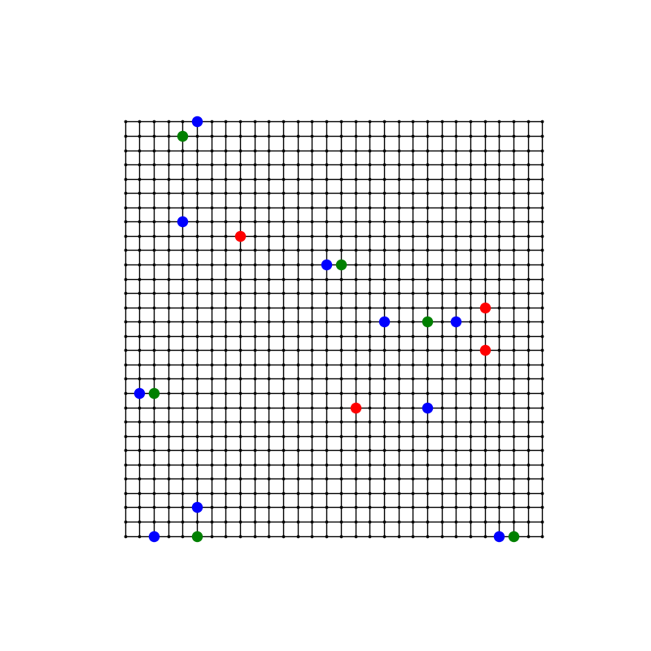

# Placement of Electric Vehicle Charging Stations

Optimizing the placement of electric vehicle (EV) charging stations is a challenging problem. The goal is to find the optimal locations for a given number of charging stations to maximize the number of EVs that can be served. To solve this problem, we can use D-Wave's quantum annealer to find the optimal locations for the charging stations using a quadratic unconstrained binary optimization (QUBO) formulation.

This repository contains the code for solving the EV charging station placement problem using simulated annealing and genetic algorithms and is based on the `ev-charger-placement` example by D-Wave [[1]](#1).

## Problem Formulation

The problem of placing electric vehicle (EV) charging stations can be formulated as a Quadratic Unconstrained Binary Optimization (QUBO) problem. Given a set of potential locations for the charging stations, we aim to identify the optimal subset of locations that maximizes the number of EVs that can be served. Let $\vec{x} = \{x_1, x_2, \dots, x_N\}$ represent binary variables indicating the possible locations of new chargers. The objective function is defined as follows [[2]](#2) :

$$H_1 = \sum_{i,j} x_i \space D(c_i, p_j)$$

$$H_2 = -\sum_{i,j} x_i \space D(c_i, v_j)$$

$$H_3 = -\sum_{i<j} x_i \space D(c_i, c_j)$$

$$H_4 = \left( \sum_i x_i \right) - n$$

$$H = \sum_{i=1}^4 \lambda_i H_i$$

where:

- $p$ denotes points of interest (POIs),
- $v$ denotes existing charging stations,
- $c$ denotes new charging stations,
- $n$ is the desired number of charging stations,
- $\lambda_i$ are the Lagrange multipliers.

The distance function $D$ is defined as:

$$
D(x, y) = \exp\left( -\frac{\|x - y\|^2}{2\sigma^2} \right)
$$

where $\sigma$ is a parameter that controls the spread of the Gaussian function.

## Code Structure

The code is organized as follows:

```monospace
│   .gitignore
│   annealing.ipynb
│   genetic.ipynb
│   README.md
│   requirements.txt
│
├───modules
│   │   evcp.py
│   │   solvers.py
│   │   utils.py
│   └───__init__.py
│
└───readme_imgs
    │   genetic_solution.png
    │   map.png
    │   old_grid.png
    └───solution_grid.png
```

The `modules` directory contains the following Python files:

- `evcp.py`: Contains the implementation of the EV Charging Problem (EVCP) class, which defines the grid, points of interest, and charging stations.
- `solvers.py`: Contains the implementation of the simulated annealing and genetic algorithm solvers.
- `utils.py`: Contains utility functions distance calculations.

The `annealing.ipynb` and `genetic.ipynb` notebooks contain the code for solving the EVCP using simulated annealing and genetic algorithms, respectively.

## Usage

To run the code, follow these steps:

1. Create a virtual environment using `python -m venv venv` and activate it.
2. Install the required packages using `pip install -r requirements.txt`.
3. Run the `annealing.ipynb` or `genetic.ipynb` notebook to solve the EVCP using simulated/quantum annealing or genetic algorithms.
4. Test different parameters and configurations.

By default, when initializing the `QuantumAnnealing` class, the sampler used is D-Wave's `SimulatedAnnealingSampler`. However, you can change the sampler to use D-Wave's quantum hybrid solver by setting `sampler=LeapHybridSampler()` during the initialization of the `QuantumAnnealing` class.

## Example

Here is an example of a grid with points of interest (POIs) and existing charging stations:\


Here is an example of the solution obtained using the genetic algorithm:\


Here is the final grid with the optimal charging station locations using quantum annealing:\


## References

- <a id="1">[1]</a> D-Wave (2021). EV Charger Placement. https://github.com/dwave-examples/ev-charger-placement.
- <a id="2">[2]</a> Aman Chandra, Jitesh Lalwani, and Babita Jajodia (2022). Towards an Optimal Hybrid Algorithm for EV Charging Stations Placement using Quantum Annealing and Genetic Algorithms. arXiv: [2111.01622 [quant-ph]](https://arxiv.org/abs/2111.01622).
